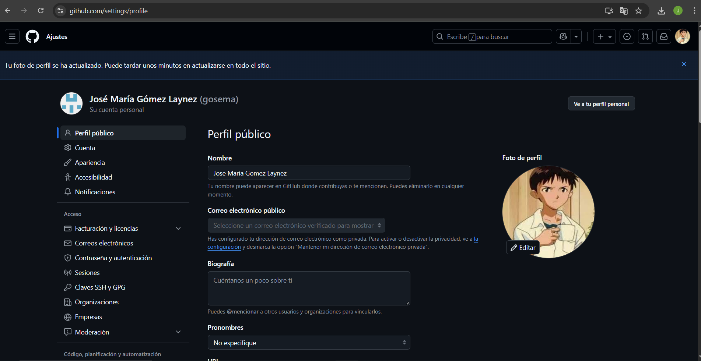
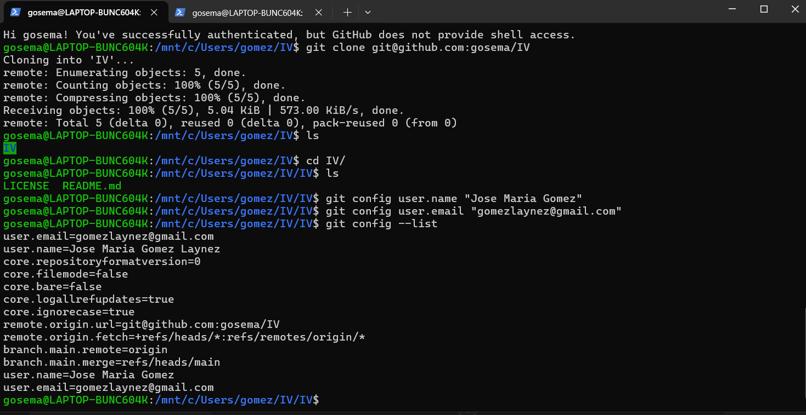
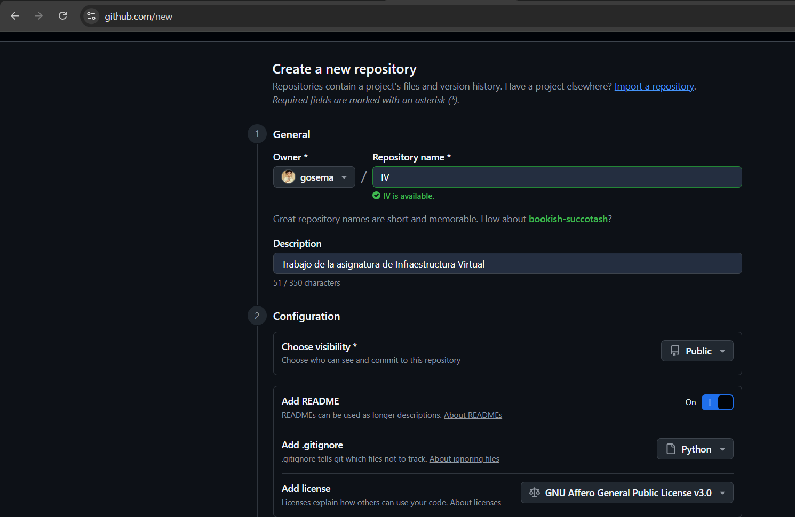
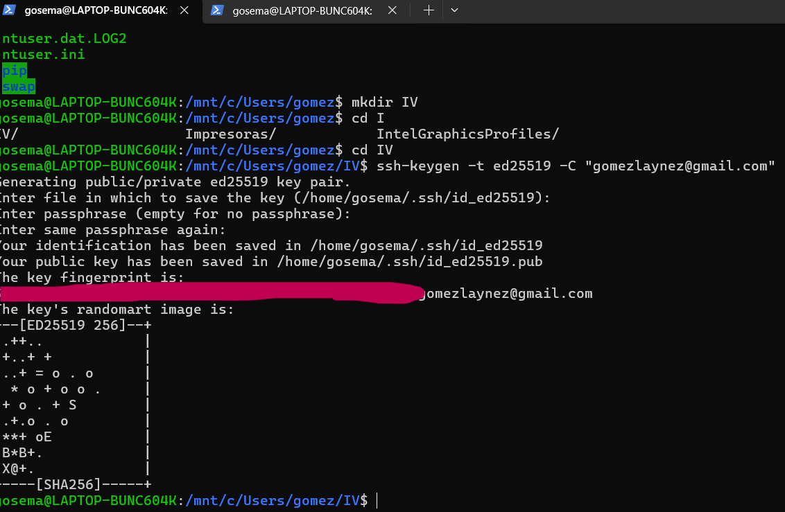
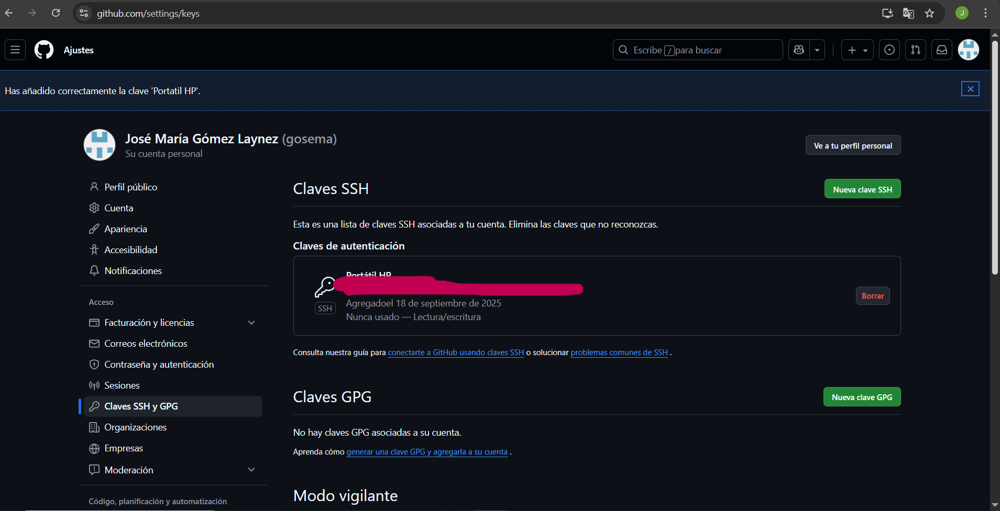
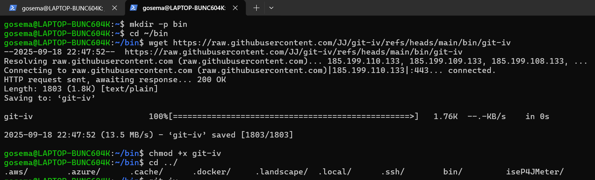
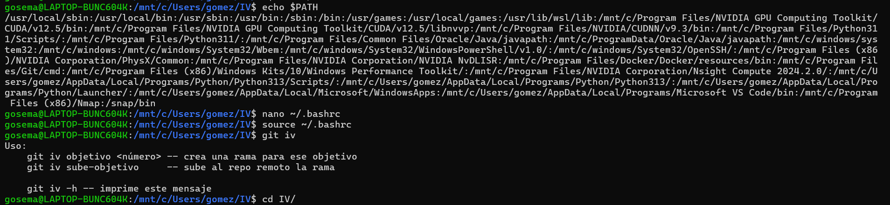

# Documentacion

## Configuración de perfil

## Configuración de commits

## Configuración de repositorio

## Generar clave

## Añadir clave

## Configuración de plugin en WSL

## Configuración de plugin en WSL parte 2

